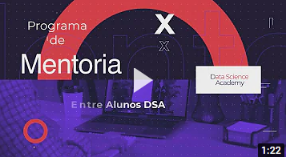

# How Much App - Estimando Valores para Planos de Saúde Individuais
Projeto em Ciência de Dados do <a href="https://blog.dsacademy.com.br/programa-de-mentoria-entre-os-alunos-dsa-temporada-2021/">programa de mentoria entre alunos DSA<a/>  
Mentor: Marcelo Wecchi 
Mentorados: Rye Santana Takeda, Guilherme Coelho Neves, Eder José de Carvalho

- [1. Sobre o projeto](#1-sobre-o-projeto)
- [2. Desafio de negócio escolhido](#2-desafio-de-negocio-escolhido)

## 1. Sobre o projeto

O programa de mentoria entre os alunos possui dois objetivos inter-relacionados e complementares

- Desenvolvimento e/ou aprimoramento de habilidades Soft skill
- Entrega de um projeto completo em Ciência de Dados

    

## 2. Desafio de negócio escolhido

Estimar valores para planos de saúde individuais
